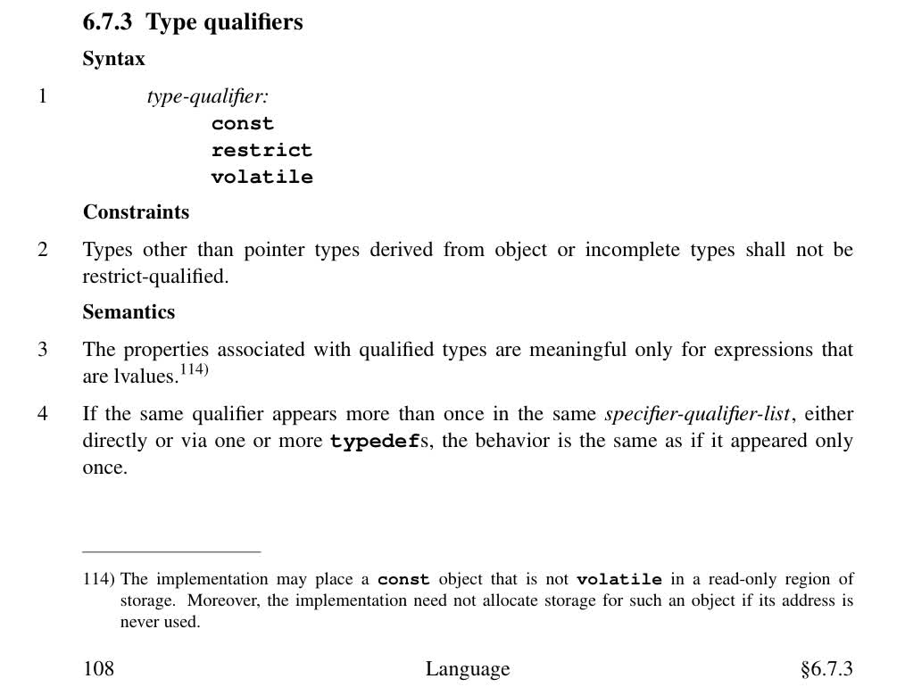
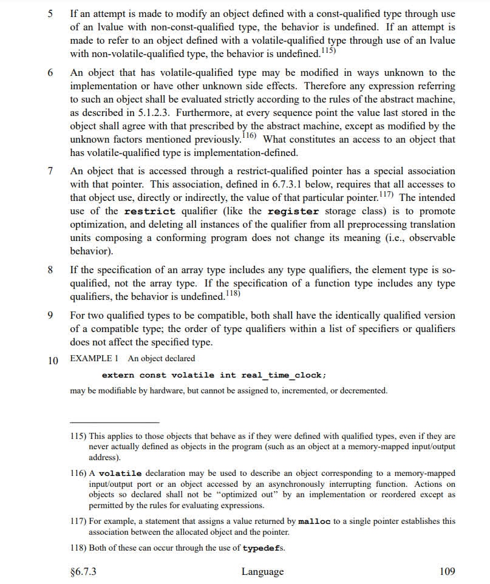
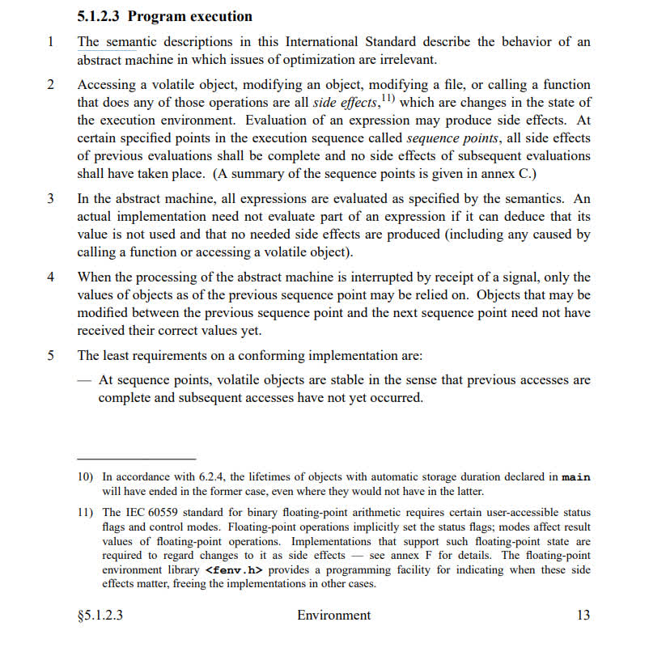
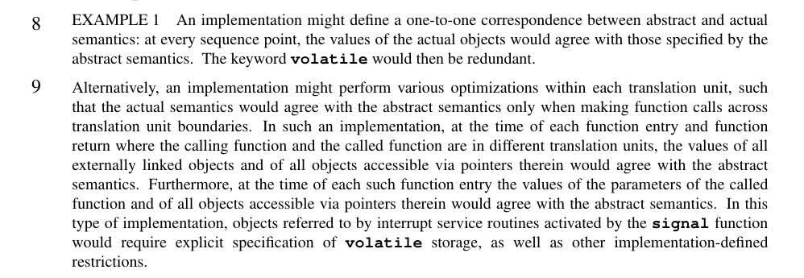
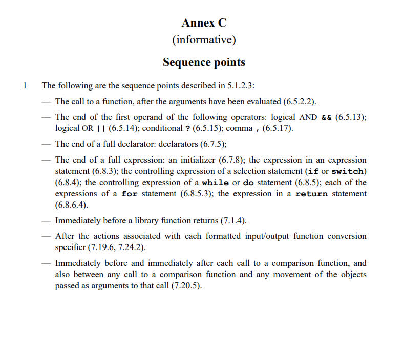

# volatile

无论是gcc的说明手册，还是C99的标准中，都没有提及volatile有可能生成额外的汇编指令(比如lock前缀)，只表明了volatile修饰的变量如果可能有需要的副作用，则不应该被编译器优化掉。
同时经过实际代码及其汇编的对照，volatile确实也仅仅是编译器优化层面的一个描述符。

volatile有如下几个性质：
1. 限定符仅对左值有效
2. volatile可以修饰易被其他进程/设备修改的对象，不会被优化（除非编译器能断定相关表达式不会被使用）
3. volatile修饰的变量可以防止被移出循环体外，读/写操作会和语义一致（即使该变量未被使用）
4. `*p1 = *p2 = 1`，编译器会先去`load(*p2)`再赋值给`*p1`。`*p1 = *(volatile int*)p2 = 1`则不会load
5. volatile修饰符并不能充当编译器内存屏障。
6. volatile可以防止内嵌汇编被编译器优化掉（编译器不知道某些指令的副作用，就假定没有副作用了？）

# [C99](http://www.open-std.org/jtc1/sc22/WG14/www/docs/n1256.pdf)

## 6.7.3 Type qualifiers

第六点：由于volatile的对象可能会有其他未知的副作用，因此任何包含volatile对象的表达式都应该严格按照`abstract machine`的规则求值。（见下图第三点）

第十点：`extern const volatile int real_time_clock;`表示该变量可能被硬件修改，但不得在代码中被修改

根据*注释116*，volatile可以用来修饰对应于某个外设IO端口，或者会被多进程修改的对象。（在一个表达式内）对该对象的操作不应该重排或者被编译器优化掉。

## abstract machine

*按我的理解，此处的`abstract machine`应该是指的编译原理中的一个概念，是编程语言和实际执行的机器码的一个中间态，忽略了一些跟实际硬件有关的细节。*

第二点规定了`sequence point`之前的所有表达式的副作用必须对之后的表达式可见。

第三点说在`abstract machine`中，所有的表达式都应该按照语义求值。但是在实际情况，如果可以推导出某个表达式的值不会被使用，也（因此）不会产生任何需要的副作用（包括调用函数或访问volatile对象所引起的任何副作用），那么就可以不对该表达式求值。（如果推导不出来则必须求值）

比如表达式`(1 || *(volatile int*)ptr = 1)`，编译后的汇编中不会有关于ptr的赋值指令

第五点规定了一个可信的实现的最低的三个要求：

- 在所有序列点，volatile的对象（无论怎么编译）都应该是稳定的，因为序列点前的所有访问都已完成，且后面的访问还未发生
- （后面两点与本文目的无关）

八、九点则是在说如果实现和实际语义是一一对应的话，volatile就是无用的（但实际情况两者不一定是一一对应的）

## sequence point

可以大致将`sequence point`理解为在**编译过程中**跳转语句(`jmp`, `je` ...)能去的节点。

比如说`num = num + 1`这条语句，可能翻译后对应几条汇编，但跳转语句只能跳转至该语句执行前或者执行后，而不能跳转至该语句中间汇编所在的地址，既前后各一个序列点。

而形如`cnt > 3 || num++`这种可短路的逻辑表达式，除了前后两个序列点，中间还有一个序列点用以短路。

---

# GCC

## When is a Volatile Object Accessed

[When is a Volatile Object Accessed](https://gcc.gnu.org/onlinedocs/gcc/Volatiles.html)

## Extended-Asm Volatile
[Extended-Asm Volatile](https://gcc.gnu.org/onlinedocs/gcc/Extended-Asm.html#Volatile-1)

## 结论翻译

1. volatile修饰符并不能充当编译器内存屏障，需要的话就乖乖用`asm volatile ("" : : : "memory")`
2. 虽然赋值表达式会产生一个右值，但是如果继续把这个（等号左边）包含volatile对象的赋值表达式赋值给其他变量，并不会重新读取该值。（编译器选择尽量避免去读这个易变的对象以确保语义和结果的一致）
3. volatile可以防止内嵌汇编被编译器优化掉